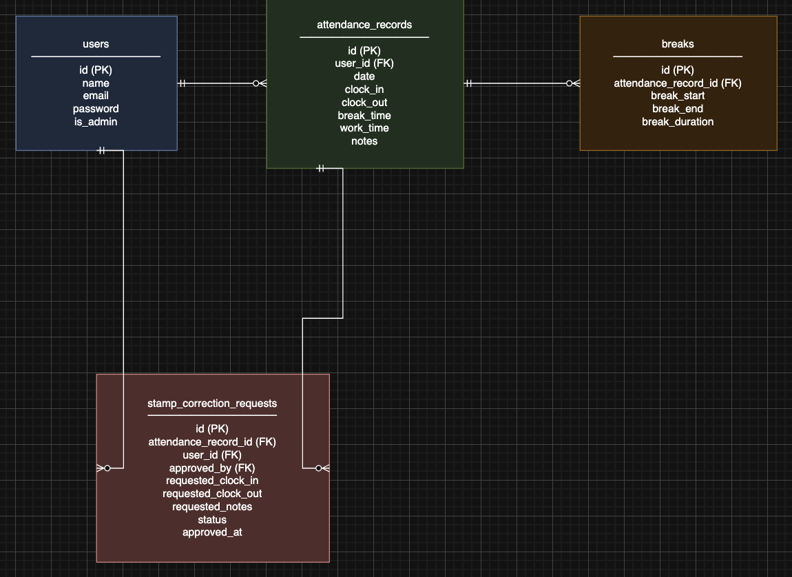

# CoachTech 勤怠管理アプリケーション

Laravel + Docker + MySQL で構築された勤怠管理システムです。
## 📋 目次

- [概要](#概要)
- [機能一覧](#機能一覧)
- [技術スタック](#技術スタック)
- [開発環境のセットアップ](#開発環境のセットアップ)
- [画面一覧](#画面一覧)
- [主要なルート](#主要なルート)
- [データベース構成](#データベース構成)
- [開発ガイド](#開発ガイド)
- [トラブルシューティング](#トラブルシューティング)

## 概要

- **サービス名**: CoachTech 勤怠管理アプリケーション

## 機能一覧

### 一般ユーザー向け機能

#### ユーザー認証
- ✅ 会員登録（バリデーション付き）
- ✅ メール認証（会員登録・初回ログイン時に必須）
- ✅ 認証メール再送機能
- ✅ ログイン/ログアウト
- ✅ エラーメッセージ表示（日本語）

#### 打刻機能
- ✅ 出勤打刻
- ✅ 退勤打刻
- ✅ 休憩開始/終了
- ✅ リアルタイムステータス表示（出勤中/休憩中/退勤済/勤務外）
- ✅ 現在時刻のリアルタイム表示

#### 勤怠管理
- ✅ 勤怠一覧表示（月別）
- ✅ 勤怠詳細表示
- ✅ 打刻修正申請
- ✅ 承認待ちステータスの表示

#### 申請管理
- ✅ 修正申請一覧表示（承認待ち/承認済みタブ）
- ✅ 申請ステータス確認
- ✅ 申請詳細表示

### 管理者向け機能

#### 認証
- ✅ 管理者専用ログイン
- ✅ 管理者権限チェック
- ✅ 一般ユーザーからのアクセス制御

#### 勤怠管理
- ✅ 全スタッフの勤怠一覧（日付別）
- ✅ 勤怠詳細表示・編集
- ✅ スタッフ別勤怠一覧（月別）
- ✅ CSVエクスポート機能（BOM付きUTF-8）

#### スタッフ管理
- ✅ スタッフ一覧表示
- ✅ スタッフ名、メールアドレスの表示
- ✅ 各スタッフの勤怠一覧へのリンク

#### 申請承認
- ✅ 打刻修正申請一覧（承認待ち/承認済みタブ）
- ✅ 申請承認/却下
- ✅ 承認時の勤怠記録自動更新
- ✅ トランザクション処理によるデータ整合性の確保

## 技術スタック

### バックエンド
- **PHP**: 8.2
- **Laravel**: 12.0
- **MySQL**: 8.0
- **Carbon**: 日時処理

### フロントエンド
- **Blade Templates**: Laravelのテンプレートエンジン
- **CSS**: Flexbox/Grid、カスタムCSS
- **JavaScript**: リアルタイム時刻表示、タブ切り替え
- **Vite**: アセットビルドツール
- **Tailwind CSS**: 4.0.0

### インフラストラクチャ
- **Docker**: コンテナ化
- **Docker Compose**: マルチコンテナ管理

## 開発環境のセットアップ

### 前提条件

- Docker Desktop がインストールされていること
- Git がインストールされていること
- 最低 4GB の空きメモリ推奨

### セットアップ手順

1. **リポジトリのクローン**

```bash
git clone <repository-url>
cd attendance-app
```

2. **`.env`ファイルの設定**

`.env.example`ファイルをコピーして`.env`ファイルを作成します：

```bash
cp .env.example .env
```

`.env`ファイルを開き、以下の環境変数を設定してください：

**開発環境（Docker）での設定：**

```env
# データベース設定（Docker環境用）
DB_CONNECTION=mysql
DB_HOST=db
DB_PORT=3306
DB_DATABASE=coachtech
DB_USERNAME=root
DB_PASSWORD=root
```

- `APP_KEY`は手順5で自動生成されます

3. **Dockerコンテナのビルドと起動**

```bash
docker compose up -d --build
```

初回起動時はビルドに時間がかかります。

**注意**: 既存のコンテナが存在する場合は、先に削除してください：

```bash
docker compose down
# または個別に削除
docker rm coachtech_db coachtech_app coachtech_phpmyadmin
```

**自動セットアップ機能：**

コンテナ起動時に`docker-entrypoint.sh`が自動的に以下を実行します：
- `vendor`ディレクトリが存在しない場合、自動的に`composer install`を実行
- ストレージディレクトリの権限を自動設定

そのため、手動で`composer install`を実行する必要はありません。

4. **アプリケーションキーの生成**

```bash
docker compose exec app php artisan key:generate
```

5. **データベースのマイグレーションとシーダーの実行**

```bash
docker compose exec app php artisan migrate:fresh --seed
```

6. **シーダー実行後、以下のユーザーでログインできます**

- **管理者ユーザー**
  - Email: `admin@example.com`
  - Password: `password`
  - 権限: 管理者（すべての機能にアクセス可能）
  - ログインURL: http://localhost:8000/admin/login
  - **注意**: メール認証が必要です。MailHog（http://localhost:8025）で認証メールを確認してください

- **テストユーザー**
  - Email: `test@example.com`
  - Password: `password`
  - 権限: 一般ユーザー
  - ログインURL: http://localhost:8000/login
  - **注意**: メール認証が必要です。MailHog（http://localhost:8025）で認証メールを確認してください

### アクセス

- **アプリケーション**: http://localhost:8000
- **phpMyAdmin**: http://localhost:8080
- **MailHog（メール確認用）**: http://localhost:8025

### テストの実行

PHPUnit は MySQL（ホスト名 `db`）上の `attendance_test` データベースを使用します。

**テスト用データベースの設定**

`phpunit.xml` にテスト用データベース設定が記載されており、自動的に `attendance_test` データベースが使用されます。

**テストの実行（推奨）**

以下の1つのコマンドで、依存関係のインストール、データベースのマイグレーション、テストの実行、開発用データベースへのシーダー実行をまとめて行います：

```bash
docker compose exec app bash -lc "cd /var/www/html && \
composer install && \
DB_CONNECTION=mysql DB_HOST=db DB_PORT=3306 \
DB_DATABASE=attendance_test DB_USERNAME=root DB_PASSWORD=root \
php artisan migrate --force && \
vendor/bin/phpunit && \
php artisan db:seed"
```

**注意**: テスト実行後、自動的に開発用データベース（`coachtech`）にシーダーが実行され、`test@example.com` と `admin@example.com` でログインできるようになります。

**個別に実行する場合**

必要に応じて、以下のコマンドを個別に実行することもできます：

1. **開発依存関係のインストール**

```bash
docker compose exec app bash -lc "cd /var/www/html && composer install"
```

2. **テスト用データベースを最新化**

```bash
docker compose exec app bash -lc "cd /var/www/html && \
DB_CONNECTION=mysql DB_HOST=db DB_PORT=3306 \
DB_DATABASE=attendance_test DB_USERNAME=root DB_PASSWORD=root \
php artisan migrate --force"
```

3. **PHPUnit を実行**

```bash
docker compose exec app bash -lc "cd /var/www/html && vendor/bin/phpunit"
```

**注意**: `php artisan test`コマンドは利用できません。`vendor/bin/phpunit`を直接実行してください。

**テスト構成**

- **Unit テスト**: `tests/Unit/` ディレクトリ
- **Feature テスト**: `tests/Feature/` ディレクトリ
  - `Auth/`: 認証関連テスト（ログイン、登録、メール認証）
  - `Attendance/`: 勤怠関連テスト
  - `Admin/`: 管理者機能テスト

**注意**: すべての開発者が同じ Docker/MySQL でテストを再現できるよう、`phpunit.xml` に接続情報を記載しています。

## 画面一覧

### 一般ユーザー向け画面

| 画面名 | URL | 説明 |
|--------|-----|------|
| ログイン画面 | `/login` | 一般ユーザーのログイン |
| 会員登録画面 | `/register` | 新規ユーザー登録 |
| メール認証画面 | `/email/verify` | メール認証の案内・再送 |
| 打刻画面（PG03） | `/attendance` | 出勤/退勤/休憩の打刻 |
| 勤怠一覧画面（PG04） | `/attendance/list` | 月別の勤怠記録一覧 |
| 勤怠詳細画面（PG05） | `/attendance/detail/{id}` | 勤怠記録の詳細表示・修正申請 |
| 申請一覧画面（PG06） | `/stamp_correction_request/list` | 修正申請の一覧（承認待ち/承認済み） |

### 管理者向け画面

| 画面名 | URL | 説明 |
|--------|-----|------|
| 管理者ログイン画面 | `/admin/login` | 管理者専用ログイン |
| 勤怠一覧画面（PG08） | `/admin/attendance/list` | 全スタッフの勤怠一覧（日付別） |
| 勤怠詳細画面（PG09） | `/admin/attendance/{id}` | 勤怠記録の詳細表示・編集 |
| スタッフ一覧画面（PG10） | `/admin/staff/list` | 全スタッフの一覧 |
| スタッフ別勤怠一覧（PG11） | `/admin/attendance/staff/{id}` | 特定スタッフの勤怠一覧（月別） |
| 申請一覧画面（PG12） | `/stamp_correction_request/list` | 全スタッフの修正申請一覧 |
| 修正申請承認画面（PG13） | `/stamp_correction_request/approve/{id}` | 修正申請の承認/却下 |

## 主要なルート

### 一般ユーザー

```php
GET  /login                                    # ログイン画面
POST /login                                    # ログイン処理
GET  /register                                 # 会員登録画面
POST /register                                 # 会員登録処理
POST /logout                                   # ログアウト処理
GET  /email/verify                             # メール認証案内画面
GET  /email/verify/{id}/{hash}                 # メール認証処理
POST /email/verification-notification          # 認証メール再送
GET  /attendance                               # 打刻画面
POST /attendance/clock-in                      # 出勤打刻
POST /attendance/clock-out                     # 退勤打刻
POST /attendance/break-start                   # 休憩開始
POST /attendance/break-end                     # 休憩終了
GET  /attendance/list                          # 勤怠一覧
GET  /attendance/detail/{id}                   # 勤怠詳細
POST /attendance/detail/{id}/request-correction # 修正申請
GET  /stamp_correction_request/list            # 申請一覧
```

### 管理者

```php
GET  /admin/login                              # 管理者ログイン画面
POST /admin/login                              # 管理者ログイン処理
POST /admin/logout                             # 管理者ログアウト処理
GET  /admin/attendance/list                    # 勤怠一覧（管理者）
GET  /admin/attendance/{id}                    # 勤怠詳細（管理者）
POST /admin/attendance/{id}/update             # 勤怠更新
GET  /admin/staff/list                         # スタッフ一覧
GET  /admin/attendance/staff/{id}              # スタッフ別勤怠一覧
GET  /admin/attendance/staff/{id}/csv          # CSVエクスポート
GET  /stamp_correction_request/list            # 申請一覧（管理者）
GET  /stamp_correction_request/approve/{attendance_correct_request_id}    # 承認画面
POST /stamp_correction_request/approve/{attendance_correct_request_id}    # 承認処理
POST /stamp_correction_request/reject/{attendance_correct_request_id}     # 却下処理
```

## データベース構成

### テーブル一覧

- `users`: ユーザー情報（管理者フラグ含む）
- `attendance_records`: 勤怠記録
- `breaks`: 休憩記録
- `stamp_correction_requests`: 打刻修正申請



### 主要なリレーション

- `User` → `AttendanceRecord` (1対多)
- `AttendanceRecord` → `BreakRecord` (1対多)
- `AttendanceRecord` → `StampCorrectionRequest` (1対多)
- `User` → `StampCorrectionRequest` (1対多)

### マイグレーションファイル

```
database/migrations/
├── 0001_01_01_000000_create_users_table.php
├── 2025_10_31_152839_add_is_admin_to_users_table.php
├── 2025_10_31_152840_create_attendance_records_table.php
├── 2025_10_31_160836_create_breaks_table.php
└── 2025_10_31_160836_create_stamp_correction_requests_table.php
```

## 開発ガイド

### メール認証フロー

このアプリでは会員登録および初回ログイン時にメール認証を必須としています。

1. **初回登録**
   - 会員登録完了後、自動的にメール認証画面（`/email/verify`）にリダイレクトされます
   - 登録時に送信された認証メール内のリンクをクリックして認証を完了してください
   - 認証が完了するまで、アプリケーションの機能は利用できません

2. **ログイン**
   - メール認証が完了していないアカウントでログインしようとすると、認証画面へリダイレクトされます
   - 認証完了後、打刻画面（`/attendance`）にリダイレクトされます

3. **認証メール再送**
   - 認証画面の「認証メールを再送」ボタンから再送できます
   - 再送は1分間に最大6回まで（レート制限あり）

4. **メール確認（ローカル環境）**
   - ローカル環境では MailHog を利用しています
   - `http://localhost:8025` を開くと受信メール（Verify Email）が確認できます
   - 認証画面には「認証はこちらから」ボタンが表示され、MailHogのプレビューURLに直接アクセスできます

**注意**: 管理者ユーザーもメール認証が必要です。

### コンテナ内でのコマンド実行

```bash
# Composer
docker compose exec app composer <command>

# Artisan
docker compose exec app php artisan <command>

# npm
docker compose exec app npm <command>
```

### よく使うコマンド

```bash
# コンテナの起動
docker compose up -d

# コンテナの停止
docker compose down

# コンテナの再起動
docker compose restart

# ログの確認
docker compose logs -f app

# データベースのリセット
docker compose exec app php artisan migrate:fresh --seed

# キャッシュのクリア
docker compose exec app php artisan cache:clear
docker compose exec app php artisan config:clear
docker compose exec app php artisan view:clear

# 管理者ユーザーの作成
docker compose exec app php artisan admin:create
```

### バリデーションルール

#### 会員登録

- **お名前**: 必須、文字列、最大255文字
- **メールアドレス**: 必須、有効なメール形式、最大255文字、一意性
- **パスワード**: 必須、最小8文字
- **パスワード確認**: パスワードと一致すること

#### ログイン

- **メールアドレス**: 必須、有効なメール形式
- **パスワード**: 必須

#### エラーメッセージ

エラーメッセージは日本語で表示されます：

**会員登録**
- `お名前を入力してください`
- `メールアドレスを入力してください`
- `メールアドレスの形式が正しくありません`
- `このメールアドレスは既に登録されています`
- `パスワードを入力してください`
- `パスワードは8文字以上で入力してください`
- `パスワードと一致しません`

**ログイン**
- `メールアドレスを入力してください`
- `パスワードを入力してください`
- `ログイン情報が登録されていません`

**管理者ログイン**
- `管理者権限がありません`

## プロジェクト構成

```
coachtech/
├── app/
│   ├── Http/
│   │   ├── Controllers/
│   │   │   ├── Auth/
│   │   │   │   ├── LoginController.php              # 一般ユーザーログイン
│   │   │   │   ├── RegisterController.php           # 会員登録
│   │   │   │   └── Admin/
│   │   │   │       └── AdminLoginController.php     # 管理者ログイン
│   │   │   ├── AttendanceController.php             # 勤怠管理
│   │   │   ├── AdminController.php                  # 管理者機能
│   │   │   └── StampCorrectionRequestController.php # 修正申請
│   │   └── Requests/
│   │       └── Auth/
│   │           ├── LoginRequest.php                 # ログインバリデーション
│   │           ├── RegisterRequest.php              # 登録バリデーション
│   │           └── AdminLoginRequest.php            # 管理者ログインバリデーション
│   ├── Models/
│   │   ├── User.php                                 # ユーザーモデル
│   │   ├── AttendanceRecord.php                     # 勤怠記録モデル
│   │   ├── BreakRecord.php                          # 休憩記録モデル
│   │   └── StampCorrectionRequest.php               # 修正申請モデル
│   └── Console/
│       └── Commands/
│           └── CreateAdminUser.php                 # 管理者ユーザー作成コマンド
├── database/
│   ├── migrations/                                  # マイグレーションファイル
│   └── seeders/
│       └── DatabaseSeeder.php                      # シーダー
├── resources/
│   └── views/
│       ├── layouts/
│       │   └── app.blade.php                       # メインレイアウト
│       ├── auth/
│       │   ├── login.blade.php                     # ログイン画面
│       │   ├── register.blade.php                   # 会員登録画面
│       │   ├── verify-email.blade.php              # メール認証画面
│       │   └── admin/
│       │       └── login.blade.php                 # 管理者ログイン画面
│       ├── attendance/
│       │   ├── index.blade.php                     # 打刻画面
│       │   ├── list.blade.php                      # 勤怠一覧
│       │   └── detail.blade.php                    # 勤怠詳細
│       ├── admin/
│       │   ├── attendance_list.blade.php           # 勤怠一覧（管理者）
│       │   ├── attendance_detail.blade.php         # 勤怠詳細（管理者）
│       │   ├── staff_list.blade.php                # スタッフ一覧
│       │   └── staff_attendance_list.blade.php     # スタッフ別勤怠一覧
│       └── stamp_correction_request/
│           ├── list.blade.php                      # 申請一覧
│           ├── admin_list.blade.php                # 申請一覧（管理者）
│           └── approve.blade.php                   # 承認画面
├── routes/
│   └── web.php                                     # ルート定義
├── public/
│   └── images/
│       └── coachtech-logo.svg                      # ロゴ
├── docker-compose.yml                              # Docker Compose設定
├── Dockerfile                                      # Dockerイメージ定義
└── README.md
```

## デザイン

### レスポンシブデザイン

- **PC対応**: 1400-1540px
- **タブレット対応**: 1024px以下
- **モバイル対応**: 768px以下
- **小型モバイル対応**: 480px以下

### カラーパレット

- 背景色: `#F0EFF2`
- カード背景: `#FFFFFF`
- テキスト色: `#000000`
- アクセント色: `#0073CC`
- エラー色: `#DC3545`
- グレー: `#737373`, `#C8C8C8`, `#E1E1E1`

### タイポグラフィ

- フォントファミリー: Inter
- フォントウェイト: 400, 700
- レスポンシブフォントサイズ: clamp関数を使用

## トラブルシューティング

### コンテナが起動しない

```bash
# コンテナのログを確認
docker compose logs app

# コンテナを再ビルド
docker compose down
docker compose up -d --build
```

### コンテナ名の競合エラー

既存のコンテナが存在する場合、以下のエラーが発生することがあります：

```
Error response from daemon: Conflict. The container name "/coachtech_db" is already in use
```

**解決方法：**

```bash
# 既存のコンテナを削除
docker rm coachtech_db

# または、すべてのコンテナを停止・削除
docker compose down
```

### サービスが起動しない（vendor/autoload.phpが見つからない）

`composer install`が実行されていない場合、以下のエラーが発生します：

```
Warning: require(/var/www/html/vendor/autoload.php): Failed to open stream
```

**解決方法：**

コンテナを再起動すると、`docker-entrypoint.sh`が自動的に`composer install`を実行します：

```bash
# コンテナを再起動
docker compose restart app

# または、コンテナを再ビルド
docker compose down
docker compose up -d --build
```

手動で実行する場合：

```bash
# Composerパッケージをインストール
docker compose run --rm app composer install
```

### APP_KEYが設定されていないエラー

初回セットアップ時、以下のエラーが発生することがあります：

```
No application encryption key has been specified
```

**解決方法：**

```bash
# アプリケーションキーを生成
docker compose exec app php artisan key:generate
```

### データベース接続エラー

`.env`ファイルのデータベース設定を確認してください：

```env
DB_CONNECTION=mysql
DB_HOST=db
DB_PORT=3306
DB_DATABASE=coachtech
DB_USERNAME=root          # 本番環境では適切なユーザー名に変更
DB_PASSWORD=              # 本番環境では強力なパスワードを設定
```

**注意**: パスワードなどの機密情報は`.env`ファイルに記載し、Gitにコミットしないでください。

### 500エラーが発生する

データベースのマイグレーションが実行されていない場合、500エラーが発生します。

**解決方法：**

```bash
# マイグレーションを実行
docker compose exec app php artisan migrate

# キャッシュをクリア
docker compose exec app php artisan cache:clear
docker compose exec app php artisan config:clear
```

### パーミッションエラー

```bash
docker compose exec app chmod -R 775 storage bootstrap/cache
```

### キャッシュの問題

```bash
docker compose exec app php artisan cache:clear
docker compose exec app php artisan config:clear
docker compose exec app php artisan view:clear
docker compose exec app php artisan route:clear
```

### マイグレーションエラー

```bash
# データベースをリセット
docker compose exec app php artisan migrate:fresh --seed
```

## ライセンス

Coachtechの模擬案件として作成。
